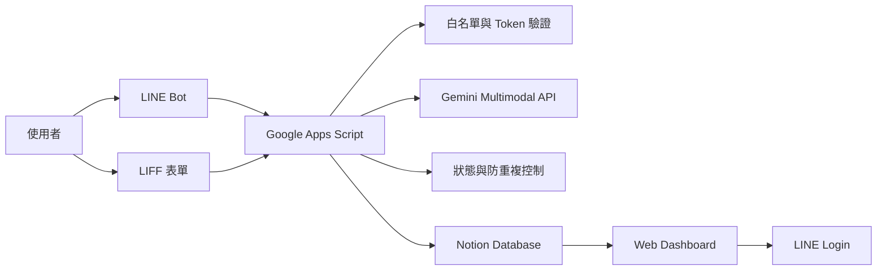
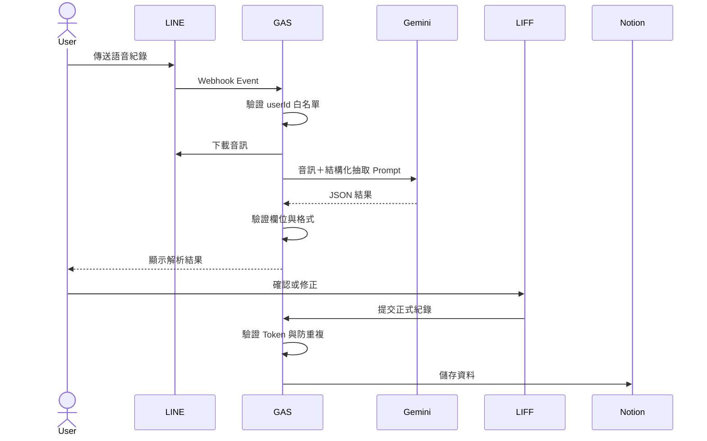

# AI Pet Health Tracker README 優化建議

Repository：`AI-Health-Tracker`

## 一、優化目標

目前專案功能已具備完整流程，但 README 偏向功能清單與部署說明，尚未充分呈現：

- Gemini 多模態音訊理解與結構化資料抽取
- Garbage In, Garbage Out 的資料品質觀念
- Human-in-the-Loop 人工確認
- 語音失敗時的容錯與多輸入管道備援
- 白名單、Token 驗證與防重複提交
- 資深工程師在架構、風險控制與技術選型上的判斷

README 應讓讀者快速理解：

> 這不是單純串接 Gemini 的 AI Demo，而是一套具備輸入、解析、驗證、確認、儲存、查詢、權限與容錯設計的端到端 AI 應用系統。

---

## 二、目前 README 可改善的部分

### 1. 專案定位不夠精準

建議標題：

```markdown
# AI Pet Health Tracker
## 多模態 AI 寵物健康紀錄助理
```

建議開場：

```markdown
針對需要長期追蹤血糖、胰島素與飲食狀況的寵物，
設計並實作一套以 LINE 為入口的多模態 AI 健康紀錄系統。

使用者可透過 LINE 文字、語音或 LIFF 表單輸入紀錄；
系統運用 Gemini 直接理解音訊並抽取結構化欄位，
經資料驗證與使用者確認後同步至 Notion，
並透過線上 Dashboard 查看歷史紀錄與變化趨勢。
```

---

### 2. 功能有列出，但沒有說明設計理由

建議新增：

```markdown
## 設計目標

1. 降低日常紀錄操作成本  
   使用者不需開啟傳統後台，可直接透過 LINE 完成輸入。

2. 控制 AI 輸出的不確定性  
   語音辨識可能受到環境噪音、語速與口音影響，
   因此 AI 結果不直接寫入正式資料。

3. 避免單一輸入方式失效  
   語音解析失敗時，可改用 LINE 文字或 LIFF 表單補正。

4. 維持資料品質與一致性  
   寫入前執行欄位驗證、合理性檢查、人工確認與防重複提交。
```

---

### 3. 多模態 AI 的價值沒有充分表達

不要只寫「Speech-to-Text」或「語音辨識」。更準確的說法是：

```markdown
## 多模態 AI 資料處理

本系統不是將 Speech-to-Text 結果直接存入資料庫，
而是將 LINE 語音音訊交由 Gemini 進行語音理解與語意抽取，
輸出固定格式的結構化健康紀錄。

資料流程：

LINE 音訊
→ Gemini 多模態理解
→ 結構化欄位抽取
→ 格式與合理性檢查
→ 使用者確認或補正
→ 寫入 Notion
```

結構化輸出範例：

```json
{
  "glucose": 120,
  "insulin": 2,
  "food": 35,
  "note": "飯後兩小時",
  "recordedAt": "2026-07-11T08:30:00+08:00"
}
```

---

### 4. 缺少 Garbage In, Garbage Out 與 Human-in-the-Loop

建議新增專章：

```markdown
## AI 可靠性與容錯設計

依據 Garbage In, Garbage Out 原則，
本系統不將 AI 輸出視為完全可信。

可能影響語音輸入品質的因素包括：

- 環境噪音
- 風聲與背景人聲
- 使用者口音與語速
- 數字發音不清楚
- 欄位缺漏
- 模型輸出格式錯誤

因此系統採用：

1. 固定 Schema 的結構化輸出
2. 必要欄位與資料型別驗證
3. 數值合理性檢查
4. Human-in-the-Loop 使用者確認
5. LINE 文字與 LIFF 表單備援
6. 解析失敗時不寫入正式資料
```

---

### 5. 缺少系統架構圖

建議加入 Mermaid：



---

### 6. 缺少語音處理 Sequence Diagram



這張圖可清楚表達：

> AI 不直接寫入正式資料，必須先經過驗證與人工確認。

---

### 7. 安全性描述應避免過度宣稱

不要使用：

```text
即使 GAS_URL 外流也無法遭人惡意讀寫
徹底杜絕重複提交
完全防止資料外洩
```

建議改成：

```markdown
## 存取控制

- LINE Bot 與 LIFF 寫入流程使用 LINE userId 白名單，
  防止未授權使用者向 Notion 寫入垃圾資料。
- LIFF 表單提交時，由後端以 LINE Access Token 取得可信任的 userId，
  不直接信任前端傳入的身分資訊。
- Dashboard 將改用 LINE Login 與後端 ID Token 驗證，
  取代 URL Query String 共用金鑰。
- 系統使用短效狀態與提交鎖，
  降低 Webhook 重送或連續操作造成重複紀錄的風險。
```

---

### 8. 區分「已完成」與「優化中」

```markdown
## 專案狀態

### 已完成

- [x] LINE Bot 文字輸入
- [x] LINE 語音訊息解析
- [x] Gemini 多模態結構化抽取
- [x] LIFF 表單補正
- [x] LINE userId 寫入白名單
- [x] Notion 同步
- [x] Dashboard 與日期篩選
- [x] 防重複提交

### 優化中

- [ ] Dashboard 整合 LINE Login
- [ ] 移除 URL Query String 共用金鑰
- [ ] 後端 ID Token 驗證
- [ ] 程式模組化
- [ ] 自動化測試
```

---

### 9. Demo 入口應放在第一屏

建議：

```markdown
[線上 Dashboard](你的網址) ·
[系統架構](#系統架構) ·
[核心設計](#核心設計決策) ·
[部署說明](#部署方式)
```

若 Dashboard 需要登入：

```markdown
> Demo Dashboard 已啟用存取控制。
> 公開頁面僅展示介面，實際寵物紀錄僅限授權使用者查看。
```

最好再加入 30～60 秒 GIF 或短影片：

```text
傳送語音
→ AI 解析
→ 使用者確認
→ Dashboard 更新
```

---

### 10. 新增核心設計決策表

| 設計問題 | 決策 | 原因 |
|---|---|---|
| 為什麼使用 LINE？ | 以既有聊天介面作為主要入口 | 降低日常紀錄操作成本 |
| 為什麼不直接儲存逐字稿？ | 抽取結構化欄位並要求確認 | 控制語音與模型誤判 |
| 語音失敗怎麼辦？ | LINE 文字與 LIFF 表單備援 | 避免單一輸入管道失效 |
| 如何防止垃圾資料？ | userId 白名單與 Token 驗證 | 僅允許家庭成員寫入 |
| 如何防止重複紀錄？ | 短效狀態、Lock 與成功後清除 | 降低重送與連續提交風險 |
| 為什麼使用 Notion？ | 作為低維運成本的紀錄後台 | 適合私人、小規模追蹤情境 |

---

### 11. 技術棧應說明元件責任

| 技術 | 系統責任 |
|---|---|
| LINE Messaging API | 接收文字、語音與互動事件 |
| LIFF | 提供資料確認與表單補正介面 |
| Gemini Multimodal API | 音訊理解與結構化欄位抽取 |
| Google Apps Script | Webhook、流程協調、驗證與第三方 API 整合 |
| Notion API | 寵物健康紀錄保存與管理 |
| Chart.js | 血糖及相關紀錄趨勢視覺化 |
| GitHub Pages | LIFF 與 Dashboard 靜態頁面部署 |
| LINE Login | Dashboard 使用者身分驗證 |

---

### 12. 部署說明移到後半部

建議閱讀順序：

1. 專案是什麼
2. 解決什麼問題
3. Demo
4. 系統架構
5. 核心工程設計
6. AI 可靠性與容錯
7. 存取控制
8. 技術棧
9. 專案狀態
10. 部署方式

---

## 三、建議的新 README 結構

```markdown
# AI Pet Health Tracker
一句話價值主張

Demo｜Screenshot｜Tech Stack Badges

## 專案背景與解決的問題
## 核心功能
## 系統架構
## 端到端資料流程
## 多模態 AI 設計
## Garbage In, Garbage Out 與 Human-in-the-Loop
## 容錯與輸入備援
## 資料品質與防重複設計
## 身分驗證與存取控制
## 核心設計決策
## 技術棧與元件責任
## 專案畫面
## 專案狀態
## 已知限制
## 未來優化
## 部署方式
## Disclaimer
```

---

## 四、README 第一屏範例

```markdown
# AI Pet Health Tracker

以 LINE 為入口的多模態 AI 寵物健康紀錄系統，
支援文字、語音與 LIFF 表單輸入，
透過 Gemini 將非結構化內容轉換為可查詢的健康資料，
並提供 Notion 儲存與線上 Dashboard 趨勢分析。

[Live Demo](你的網址) ·
[Architecture](#系統架構) ·
[Design Decisions](#核心設計決策)

## 專案亮點

- LINE 文字、語音與 LIFF 表單多管道輸入
- Gemini 多模態音訊理解與結構化欄位抽取
- Human-in-the-Loop 人工確認流程
- 語音失敗時的文字與表單備援
- 白名單、Token 驗證與防重複提交
- Notion 紀錄管理與 Dashboard 趨勢查詢
```

---

## 五、核心功能建議文案

```markdown
## 核心功能

### 多管道資料輸入

使用者可透過 LINE 文字、LINE 語音或 LIFF 網頁表單新增紀錄。

### 多模態 AI 解析

Gemini 直接理解 LINE 音訊，
並抽取血糖、胰島素、飲食、時間與備註等結構化欄位。

### 資料品質控制

AI 輸出不直接寫入 Notion，
必須經過欄位驗證、合理性檢查與使用者確認。

### 容錯與備援

語音受環境噪音、口音或語速影響時，
使用者可改用 LINE 文字或 LIFF 表單補正。

### 存取控制

使用 LINE userId 白名單限制未授權寫入；
Dashboard 則規劃以 LINE Login 與後端 Token 驗證控制讀取權限。

### 趨勢視覺化

Dashboard 支援日期區間篩選、多寵物切換，
以及血糖、胰島素、飲食與備註查詢。
```

---

## 六、已知限制建議

```markdown
## 已知限制

- 本專案用於寵物健康紀錄，不提供醫療診斷。
- AI 解析結果可能受到環境噪音、口音與語速影響。
- 所有 AI 解析結果需經使用者確認後才寫入正式資料。
- Notion 適合私人與小規模紀錄，不適合大型即時交易場景。
- Google Apps Script 受執行時間與 API Quota 限制。
- Dashboard LINE Login 與 ID Token 驗證仍在優化中。
```

---

## 七、未來優化建議

```markdown
## 未來優化

- Dashboard 整合 LINE Login
- 移除 URL Query String 共用金鑰
- GAS 後端驗證 LINE ID Token
- 拆分大型 Code.gs
- 建立自動化測試
- 加入 GitHub Actions
- 建立錯誤碼與 Structured Logging
- 增加 CSV 匯出
- 增加異常趨勢提醒
```

---

## 八、最優先修改的 6 項

1. 將專案定位改為 `AI Pet Health Tracker`。
2. 第一屏加入一句話價值主張、Demo 與架構入口。
3. 明確說明 Gemini 是多模態音訊理解與結構化抽取。
4. 新增 Garbage In, Garbage Out、Human-in-the-Loop 與容錯設計。
5. 修正「徹底杜絕」「完全無法遭惡意讀寫」等絕對描述。
6. 將部署說明移至後半部，前半部先展示工程設計。

---

## 九、優化後的求職價值

優化前，技術主管可能只看到：

> LINE Bot 串 Gemini、Notion 和 Dashboard。

優化後，應讓人看到：

> 針對 AI 不確定性與真實使用環境，設計多模態輸入、結構化抽取、資料驗證、Human-in-the-Loop、備援、權限與防重複機制，並完成端到端系統整合。

README 呈現力預估：

```text
目前：約 6.5～7/10
優化後：約 8.5/10
```

專案更適合定位為：

> 可實際運作的端到端多模態 AI 應用系統
