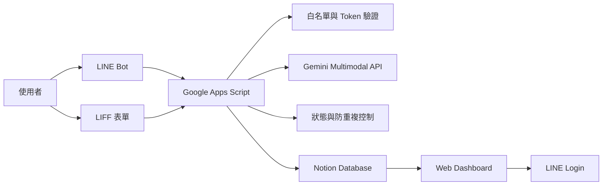
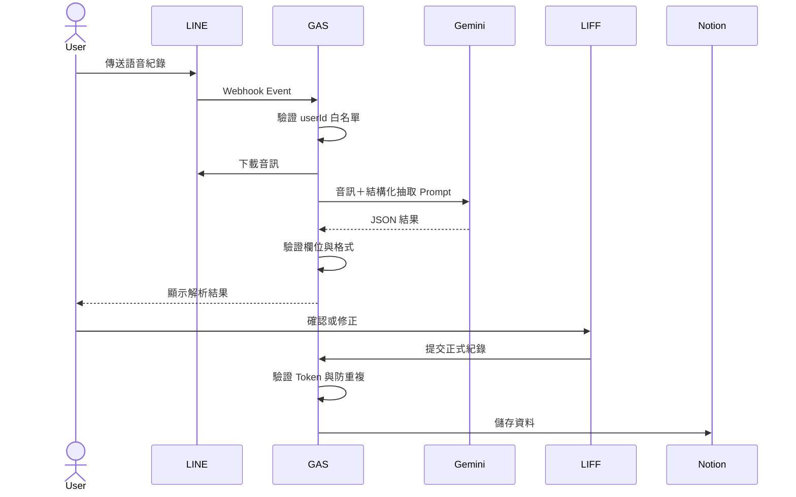
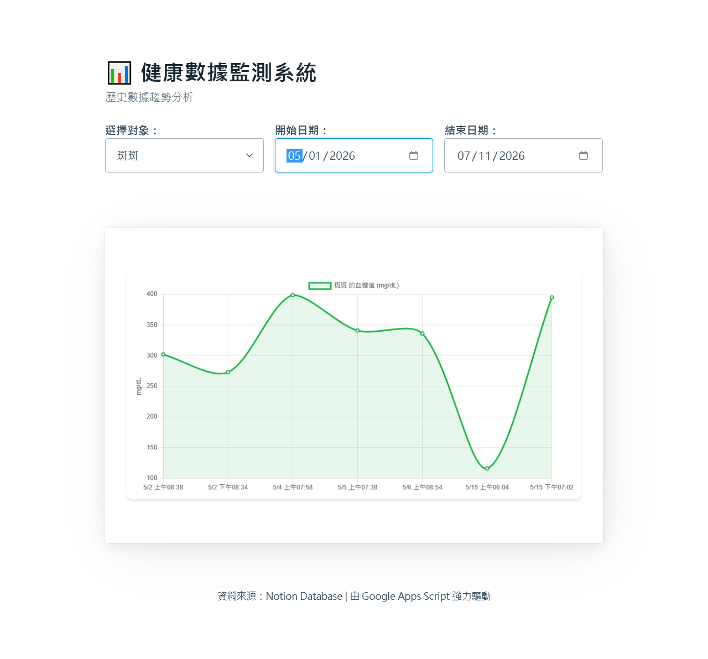

# AI Health Tracker

以 LINE 為入口的多模態 AI 健康紀錄系統，支援文字、語音與 LIFF 表單輸入，透過 Gemini 將非結構化內容轉換為可查詢的健康資料，並提供 Notion 儲存與線上 Dashboard 趨勢分析。

[線上 Dashboard](https://funrock99.github.io/AI-Health-Tracker/) · [系統架構](#系統架構) · [核心設計決策](#核心設計決策) · [部署說明](#部署方式)

> Demo Dashboard 已啟用存取控制。公開頁面僅展示介面，實際紀錄僅限授權使用者查看。

## 專案亮點

- LINE 文字、語音與 LIFF 表單多管道輸入
- Gemini 多模態音訊理解與結構化欄位抽取
- Human-in-the-Loop 人工確認流程
- 語音失敗時的文字與表單備援
- 白名單、Token 驗證與防重複提交
- Notion 紀錄管理與 Dashboard 趨勢查詢

## 專案背景與解決的問題

針對需要長期追蹤血糖、胰島素與飲食狀況的使用者與照護對象（如長輩或寵物），設計並實作一套以 LINE 為入口的多模態 AI 健康紀錄系統。

1. **降低日常紀錄操作成本**  
   使用者不需開啟傳統後台，可直接透過 LINE 完成輸入。
2. **控制 AI 輸出的不確定性**  
   語音辨識可能受到環境噪音、語速與口音影響，因此 AI 結果不直接寫入正式資料。
3. **避免單一輸入方式失效**  
   語音解析失敗時，可改用 LINE 文字或 LIFF 表單補正。
4. **維持資料品質與一致性**  
   寫入前執行欄位驗證、合理性檢查、人工確認與防重複提交。

## 核心功能

### 多管道資料輸入
使用者可透過 LINE 文字、LINE 語音或 LIFF 網頁表單新增紀錄。

### 多模態 AI 解析
Gemini 直接理解 LINE 音訊，並抽取血糖、胰島素、飲食、時間與備註等結構化欄位。

### 資料品質控制
AI 輸出不直接寫入 Notion，必須經過欄位驗證、合理性檢查與使用者確認。

### 容錯與備援
語音受環境噪音、口音或語速影響時，使用者可改用 LINE 文字或 LIFF 表單補正。

### 存取控制
使用 LINE userId 白名單限制未授權寫入；Dashboard 則以 LINE Login 與後端 Token 驗證控制讀取權限。

### 趨勢視覺化
Dashboard 支援日期區間篩選、紀錄對象切換，以及血糖、胰島素、飲食與備註查詢。

## 系統架構



## 端到端資料流程



## 多模態 AI 資料處理

本系統不是將 Speech-to-Text 結果直接存入資料庫，而是將 LINE 語音音訊交由 Gemini 進行語音理解與語意抽取，輸出固定格式的結構化健康紀錄。

資料流程：
LINE 音訊 → Gemini 多模態理解 → 結構化欄位抽取 → 格式與合理性檢查 → 使用者確認或補正 → 寫入 Notion

結構化輸出範例：
```json
{
  "glucose": 120,
  "insulin": 2,
  "food": 35,
  "note": "飯後兩小時",
  "datetime": "2026-07-11 08:30"
}
```

## AI 可靠性與容錯設計 (Garbage In, Garbage Out)

依據 Garbage In, Garbage Out 原則，本系統不將 AI 輸出視為完全可信。可能影響語音輸入品質的因素包括：環境噪音、風聲與背景人聲、使用者口音與語速、數字發音不清楚、欄位缺漏、模型輸出格式錯誤。

因此系統採用：
1. 固定 Schema 的結構化輸出
2. 必要欄位與資料型別驗證
3. 數值合理性檢查
4. Human-in-the-Loop 使用者確認
5. LINE 文字與 LIFF 表單備援
6. 解析失敗時不寫入正式資料

## 存取控制

- LINE Bot 與 LIFF 寫入流程使用 LINE userId 白名單，防止未授權使用者向 Notion 寫入垃圾資料。
- LIFF 表單提交時，由後端以 LINE Access Token 取得可信任的 userId，不直接信任前端傳入的身分資訊。
- Dashboard 使用 LINE Login 與後端 ID Token 驗證，取代 URL Query String 共用金鑰。
- 系統使用短效狀態與提交鎖，降低 Webhook 重送或連續操作造成重複紀錄的風險。

### LINE Webhook Signature 的平台限制

LINE Messaging API 建議 Webhook 接收端驗證 HTTP Header 中的 `x-line-signature`，以確認請求確實由 LINE Platform 發出，且傳輸內容未遭篡改。

本專案目前採用 Google Apps Script Web App 作為 Webhook 接收端。然而，GAS 的 `doPost(e)` 並未提供讀取傳入 HTTP Headers 的介面，因此純 GAS 架構無法取得 `x-line-signature`，也無法直接完成 LINE 官方的 HMAC-SHA256 簽章驗證。

目前此專案定位為私人、低流量的健康紀錄工具，透過以下方式降低風險：

* 限制允許操作的 LINE userId
* 驗證事件資料結構與必要欄位
* 不在程式碼中保存 API Token 與密鑰
* 限制系統功能及資料存取範圍
* 對 LIFF 與 Dashboard 使用 LINE Token 驗證

若未來擴展為多人或正式服務，將在 GAS 前方增加 Cloud Run、Cloud Functions 或其他可讀取 HTTP Headers 的 Webhook Gateway，先完成 LINE Signature 驗證，再將通過驗證的事件安全轉送至 GAS。

## 核心設計決策

| 設計問題 | 決策 | 原因 |
|---|---|---|
| 為什麼使用 LINE？ | 以既有聊天介面作為主要入口 | 降低日常紀錄操作成本 |
| 為什麼不直接儲存逐字稿？ | 抽取結構化欄位並要求確認 | 控制語音與模型誤判 |
| 語音失敗怎麼辦？ | LINE 文字與 LIFF 表單備援 | 避免單一輸入管道失效 |
| 如何防止垃圾資料？ | userId 白名單與 Token 驗證 | 僅允許家庭成員寫入 |
| 如何防止重複紀錄？ | 短效狀態、Lock 與成功後清除 | 降低重送與連續提交風險 |
| 為什麼使用 Notion？ | 作為低維運成本的紀錄後台 | 適合私人追蹤情境，且支援透過 MCP (Model Context Protocol) 使用自然語言進行查詢 |

## 技術棧與元件責任

| 技術 | 系統責任 |
|---|---|
| LINE Messaging API | 接收文字、語音與互動事件 |
| LIFF | 提供資料確認與表單補正介面 |
| Gemini Multimodal API | 音訊理解與結構化欄位抽取 |
| Google Apps Script | Webhook、流程協調、驗證與第三方 API 整合 |
| Notion API | 健康紀錄保存與管理 |
| Chart.js | 血糖及相關紀錄趨勢視覺化 |
| GitHub Pages | LIFF 與 Dashboard 靜態頁面部署 |
| LINE Login | Dashboard 使用者身分驗證 |

## 專案畫面



## 專案狀態

### 已完成
- [x] LINE Bot 文字輸入
- [x] LINE 語音訊息解析
- [x] Gemini 多模態結構化抽取
- [x] LIFF 表單補正
- [x] LINE userId 寫入白名單
- [x] Notion 同步
- [x] Dashboard 與日期篩選
- [x] 防重複提交
- [x] Dashboard 整合 LINE Login
- [x] 移除 URL Query String 共用金鑰
- [x] GAS 後端驗證 LINE ID Token

### 優化中
- [ ] 程式模組化
- [ ] 自動化測試
- [ ] 建立錯誤碼與 Structured Logging
- [ ] 增加異常趨勢提醒

## 已知限制

- 本專案用於健康數據紀錄輔助，不提供專業醫療診斷。
- AI 解析結果可能受到環境噪音、口音與語速影響。
- 所有 AI 解析結果需經使用者確認後才寫入正式資料。
- Notion 適合私人與小規模紀錄，不適合大型即時交易場景。
- Google Apps Script 受執行時間與 API Quota 限制。

## 部署方式

若要自行部署此專案，請依照以下步驟將程式碼部署至 Google Apps Script (GAS)：

### 1. 建立專案與貼上程式碼
1. 前往 Google Apps Script 建立新專案。
2. 僅將本專案中的 `Code.gs` 內容複製並貼上至 GAS 編輯器中（`form.html` 與 `index.html` 為前端網頁，不需放到 GAS）。

### 2. 設定環境變數 (Script Properties)
在 GAS 編輯器左側，點擊「專案設定 (齒輪圖示)」，新增指令碼屬性：
- `NOTION_TOKEN`: Notion Integration Secret。
- `DATABASE_ID`: Notion 資料庫 ID。
- `LINE_ACCESS_TOKEN`: LINE Bot 頻道存取權杖。
- `ALLOWED_USERS`: 授權使用的 LINE User IDs (以逗號分隔)。
- `GEMINI_API_KEY`: Google Gemini API Key。
- `LIFF_CHANNEL_ID`: LINE Login 的 Channel ID。
- `PET_NAME`: 預設對象名稱。

### 3. 發布為網頁應用程式 (Web App)
1. 點擊「部署」>「新增部署作業」，選擇「網頁應用程式」。
2. 執行身分選擇「我」，誰可以存取選擇「所有人」。
3. 部署後取得「網頁應用程式網址 (Web App URL)」。

### 4. 綁定 LINE Webhook
- 將 Web App URL 填入 LINE Developer Console 的 **Webhook URL** 並啟用。

### 5. 部署前端網頁 (LIFF 與儀表板)
1. 使用編輯器打開 `form.html` 與 `index.html`。
2. 找到 `GAS_URL` 替換為您的 Web App URL，並將 `index.html` 中的 `LIFF_ID` 換成您註冊的 LINE Login LIFF ID。
3. 將這兩個檔案部署至網頁代管空間 (如 GitHub Pages)。
4. 在 LINE Developer Console 中設定 LIFF App 的 Endpoint URL。

### 6. 自動化部署 (CI/CD via GitHub Actions)
為了避免每次修改 `Code.gs` 都需要手動複製貼上至 GAS 編輯器，本專案已支援透過 **GitHub Actions** 與 **clasp** 工具實現自動化部署。

**設定步驟：**
1. **開啟 GAS API 授權**：前往 [Google Apps Script 使用者設定頁面](https://script.google.com/home/usersettings) 將 API 設定為「開啟 (ON)」。
2. **取得指令碼 ID**：在您的 GAS 專案中，點擊左側齒輪（專案設定），複製「指令碼 ID」。
3. **建立 `.clasp.json`**：在專案根目錄建立此檔案，填入您的指令碼 ID：
   ```json
   {
     "scriptId": "您的指令碼_ID",
     "rootDir": "."
   }
   ```
4. **取得登入憑證**：在本機終端機輸入 `npm install -g @google/clasp` 安裝 clasp，然後執行 `clasp login` 登入 Google 帳號。完成後，將 `~/.clasprc.json` 檔案內的整段內容複製起來。
5. **設定 GitHub Secrets**：前往 GitHub 專案的 **Settings** > **Secrets and variables** > **Actions**，新增名為 `CLASP_TOKEN` 的 Secret，並貼上剛剛複製的內容。
6. **修改 `deploy.yml` 部署 ID (選擇性)**：若希望每次 Push 不只更新程式碼，還能「自動更新上線的 Web App 版本」，請修改 `.github/workflows/deploy.yml` 中的 `clasp deploy -i <您的_Deployment_ID>` 參數。

完成後，每次將修改推送到 GitHub 的 `main` 分支時，GitHub Actions 就會自動將 `Code.gs` 覆蓋至 GAS 專案並發布新版本！
